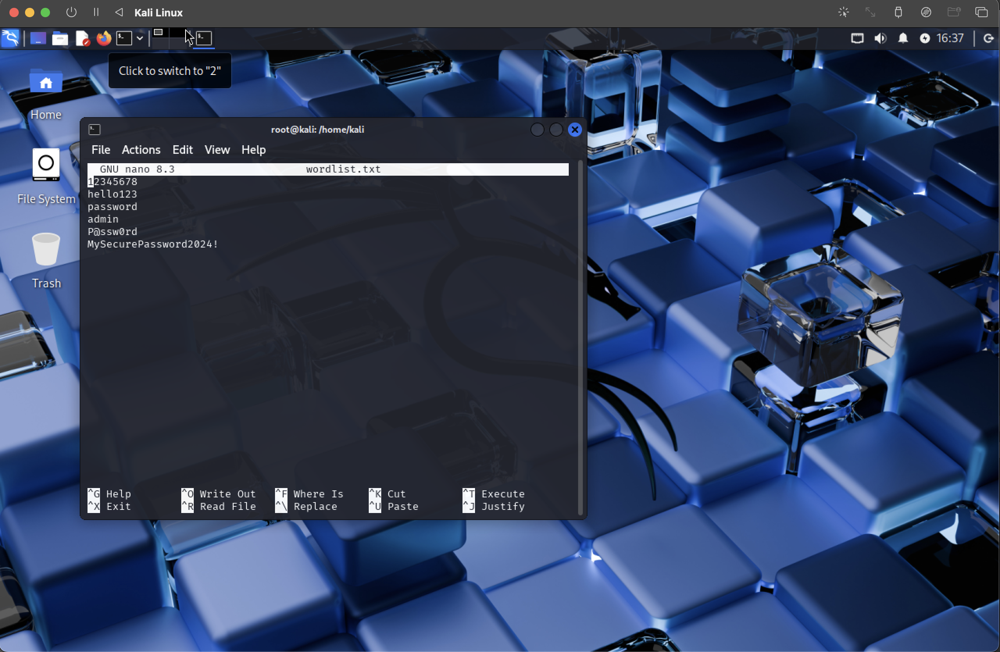

# 🔐 Lab 02 – Password Strength Testing with John the Ripper

## 🧠 Objective
Simulate how attackers test password strength by cracking SHA-256 password hashes using John the Ripper and a custom wordlist.

---

## 🛠️ Tools Used
- Kali Linux (running on MacBook via UTM)
- John the Ripper
- Terminal

---

## ⚙️ Steps

### 1. Created Passwords
```bash
echo "hello123" > passwords.txt
echo "P@ssw0rd" >> passwords.txt
echo "12345678" >> passwords.txt
echo "MySecurePassword2024!" >> passwords.txt

# Convert passwords to SHA-256 hashes
while read pass; do echo -n "$pass" | sha256sum; done < passwords.txt > hashes.txt

# Clean the hashes (remove extra formatting)
cut -d ' ' -f1 hashes.txt > clean_hashes.txt

# Run John the Ripper with custom wordlist
john --format=raw-sha256 clean_hashes.txt --wordlist=wordlist.txt

# Show any cracked passwords
john --show clean_hashes.txt

## 📸 Screenshots

### ✅ Wordlist Created in Nano
Click to view the full image:

[](screenshots/wordlist_edit.png)
